# ECE444-F2022-Lab1

Arsh Kadakia

**Activity 1: Initial README Commit.**

**Activity 2: Merge of "develop" branch**

**Activity 3: Merge PR**

**Activity 4: Collaboration**

Link to teammate's repo: https://github.com/sepehr79h/ECE444-F2022-Lab1/
My Commit to Teammate's Repo:

My Teammate's Commit to My Repo: 

**Activity 5: Rebasing**

Screenshot of Commit C1
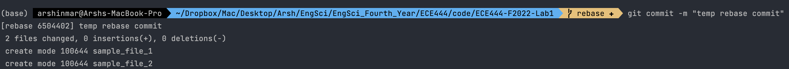
Screenshot of Commit C2
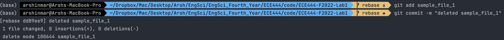
Screenshot of Commit C3
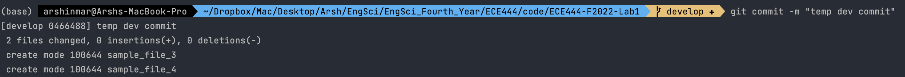
Screenshot of Commit C4
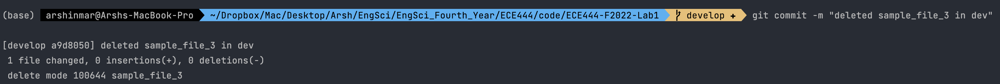
Rebase Command
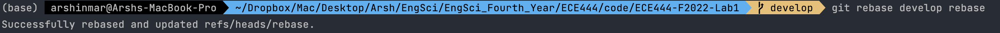
New Commit Order in Rebase
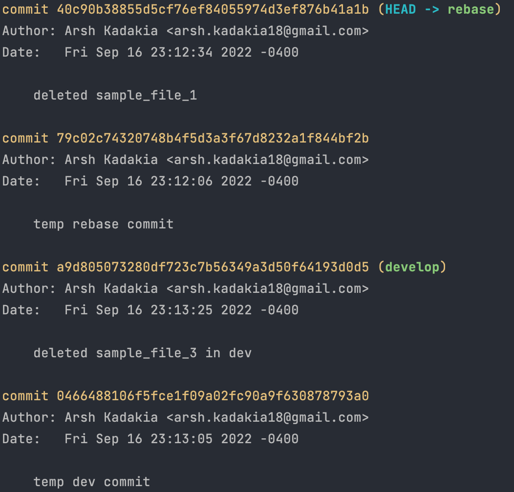

**Activity 6: Setting up Education Pathways**
New Repo Link: https://github.com/arshinmar/ECE444-F2022-EP

**Activity 7: Front Page Title Modification**

Rebase Command
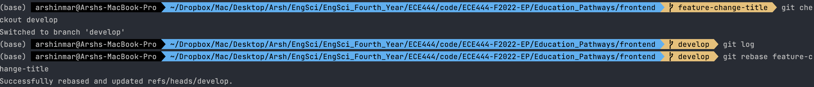
New Commit Log for Develop Branch
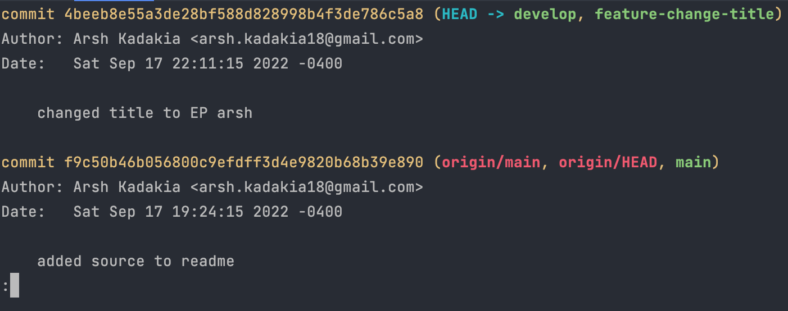
New Frontpage With Modified Title
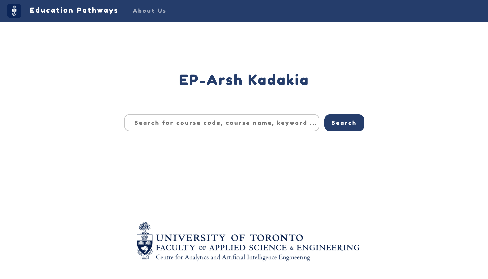

**Activity 8: Navbar Tab Addition**
Rebase Command
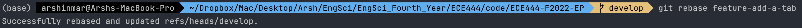
New Commit Log for Develop Branch
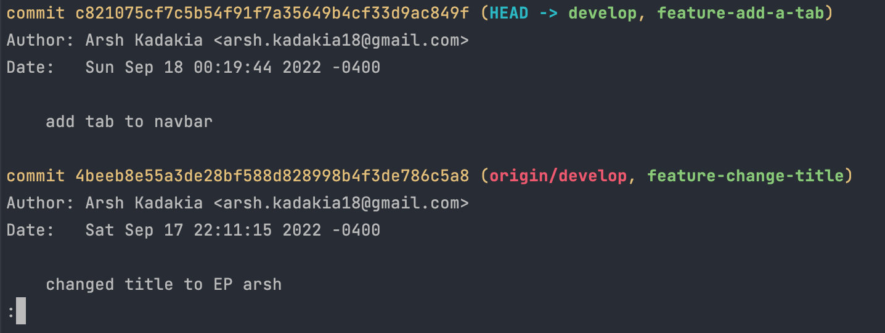
New Frontpage with Additional Navbar Tab
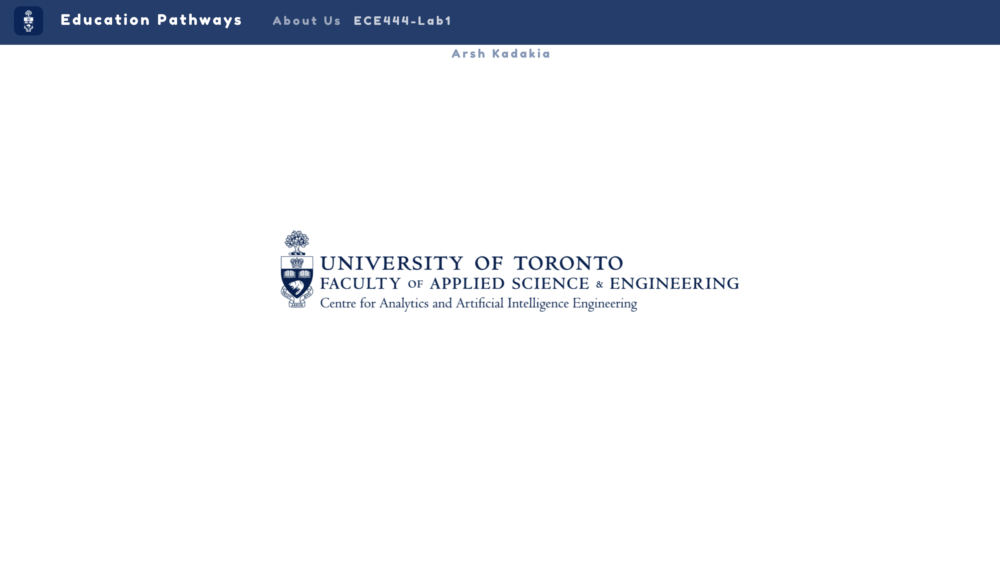