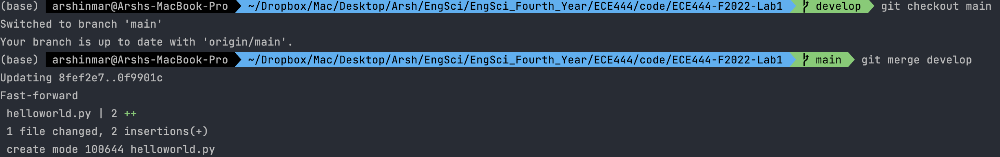

# ECE444-F2022-Lab1

Arsh Kadakia

**Activity 1: Initial README Commit.**

**Activity 2: Merge of "develop" branch**

**Activity 3: Merge PR**

**Activity 4: Collaboration**

Link to teammate's repo: https://github.com/sepehr79h/ECE444-F2022-Lab1/
My Commit to Teammate's Repo:

My Teammate's Commit to My Repo: 

